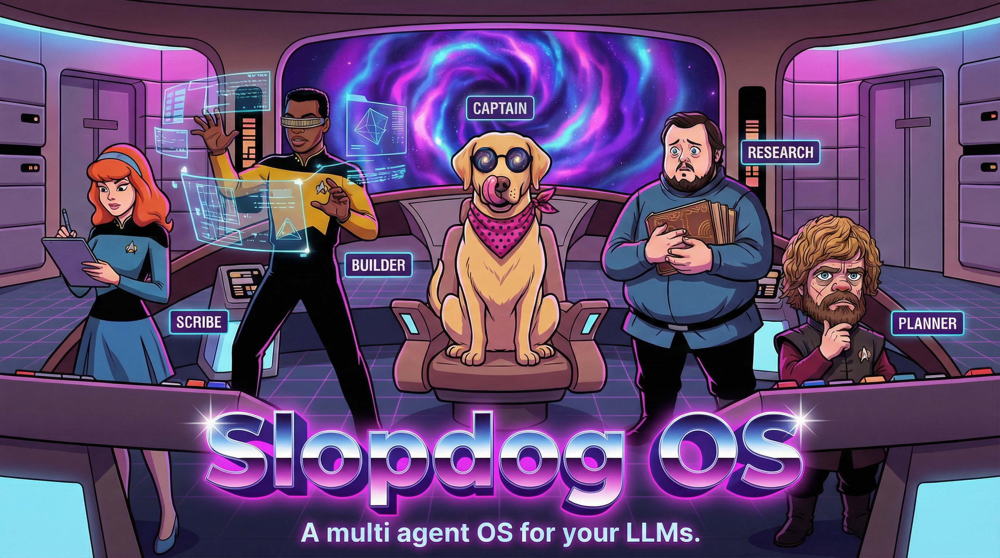

# Slopdog OS



A **spec-driven, test-driven workflow system** for [Cursor](https://cursor.sh/)[^1].

A set of opinions and conventions that use the same project scaffolding, tech stack, and approach to build fully functional greenfield projects—from idea to shareable—in the shortest possible path.

We're also building **Slopdog UI**, a standalone interface for running these workflows outside of Cursor.

[^1]: While Slopdog OS should work just as well in Claude, I stick to Cursor because I prefer using Gemini 3 Flash for execution tasks and Opus/Codex 5.1 for planning tasks. Cursor is more open and doesn't lock you into a single family of models.

## Why Slopdog OS?

Inspired by [BMAD](https://github.com/bmadcode/BMAD-METHOD) and [Agent OS](https://github.com/anthropics/agent-os) but much lighter and more opinionated. Built for fresh greenfield, medium-complexity projects:

- **Spec-first**: Every ticket has acceptance criteria and test requirements before code
- **Consistent scaffolding**: All projects start from [Slopdog Vanilla](https://github.com/morrillt/slopdog-vanilla)
- **Same stack, every time**: Predictable tech choices across all projects
- **Same folder conventions**: Predictable file structure across all projects
- **Deep research workflows**: Structured research that goes beyond default tool capabilities

## Quick Start

1. Run `/broz/init` to scaffold a new project from Slopdog Vanilla
2. Type `/broz/plan` to enter Plan Mode and start defining work
3. Use `/broz/build` to implement tracked tickets
4. Use `/broz/docs` for documentation and research

## Tech Stack Conventions

All Slopdog OS projects follow the same stack:

| Layer | Tool | Purpose |
|-------|------|---------|
| Framework | **Next.js** | React framework with App Router |
| Database | **SQLite** | Local-first persistence |
| UI Components | **shadcn/ui** | Accessible, composable components |
| Theming | **Catppuccin** | Consistent color scheme across projects |
| Layout | **Utility Drawers** | Consistent navigation and tool panels |
| Unit Tests | **Vitest** | Component and utility testing |
| E2E Tests | **Playwright** | Browser automation and integration tests |
| Scaffolding | **Slopdog Vanilla** | Starter template with all of the above |

Every ticket includes both unit and e2e test requirements—no feature ships without coverage.

## Modes & Personas

Each mode has a distinct character that shapes how the AI communicates and what actions are available.

| Mode | Command | Persona | Purpose |
|------|---------|---------|---------|
| **Plan** | `/broz/plan` | Tyrion Lannister 🦁 | Epic & ticket creation |
| **Build** | `/broz/build` | Geordi La Forge 🔧 | Tracked implementation |
| **Docs** | `/broz/docs` | Samwell Tarly 📜 | Documentation & research |

## Workflows

Each mode has workflows—step-by-step processes the AI follows.

### Plan Workflows
| Workflow | Purpose |
|----------|---------|
| `new_epic` | Create a new epic/PRD |
| `add_ticket` | Add a ticket to an epic |
| `shard_tickets` | Break an epic into tickets |
| `validate_ticket` | Verify ticket is ready for build |

### Build Workflows
| Workflow | Purpose |
|----------|---------|
| `continue` | Execute/continue ticket implementation |
| `code_review` | Review completed ticket work |

### Docs Workflows
| Workflow | Purpose |
|----------|---------|
| `create_research` | Deep research on a topic |
| `create_how_to` | Create a how-to guide |
| `create_dev_note` | Create a developer note |
| `audit` | Audit existing documentation |
| `update_architecture` | Update architecture docs + changelog |
| `publish` | Publish documentation |

### Task Workflows
| Workflow | Purpose |
|----------|---------|
| `new` | Start a new quick task |
| `file_bug` | File a bug report |
| `confirm_bug_fixed` | Verify a bug fix |
| `commit_to_main` | Commit changes to main |
| `summarize` | Summarize task work |

### Other
| Workflow | Purpose |
|----------|---------|
| `init` | Bootstrap a new project from Slopdog Vanilla |

## Skills

Skills are reusable capabilities that can be invoked across workflows. They encapsulate complex tasks like searching external sources or running scripts.

### Research Skills

| Skill | Purpose |
|-------|---------|
| `youtube-search` | Search YouTube and download video transcripts for research |
| `github-search` | Look up official repos, verify maintenance status, extract README info |
| `reddit-search` | Search Reddit threads for community insights and recommendations |
| `web-search` | General web search best practices and patterns |

### System Skills

| Skill | Purpose |
|-------|---------|
| `create-rule` | Create Cursor rules (`.mdc` files) for persistent AI guidance |
| `create-skill` | Author new agent skills with proper structure |
| `create-subagent` | Create specialized subagents for complex tasks |
| `update-cursor-settings` | Modify Cursor/VSCode settings programmatically |
| `migrate-to-skills` | Migrate existing capabilities into the skills format |

### Using Skills

Skills are automatically discovered by Cursor's agent system. When a trigger scenario matches, the skill is loaded and its instructions are followed.

Example: When you ask "find me a YouTube tutorial on RAG", the `youtube-search` skill activates and guides the AI through searching, evaluating videos, and optionally downloading transcripts.

## Directory Structure

```
~/.slopdog/            # canonical home -- tool-neutral on purpose
├── commands/broz/     # Entry points (SOURCE -- installed into each tool)
├── rules/broz/        # Modes + workflows (.mdc), read in place
├── skills/            # Reusable capabilities + scripts
├── plans/             # State tracking (context.yaml)
├── docs/              # Documentation
├── templates/         # Document templates
├── targets.conf       # Which tools get the commands + skills
├── skills.conf        # Which skills this repo owns
├── install.sh         # Renders the above into those tools
└── SHIMS.md           # How the shims work, + the Cursor/Claude source docs
```

## Install

Broz OS lives in `~/.slopdog`. Each tool then gets its own copy of the command
shims, rendered from `commands/broz/`:

```bash
git clone git@github.com:morrillt/slopdog-os.git ~/.slopdog
cd ~/.slopdog && ./install.sh
```

| | |
|---|---|
| `./install.sh` | Install/refresh shims. Hand-edited files are preserved. |
| `./install.sh --force` | Overwrite hand-edited shims too. |
| `./install.sh --check` | Report drift, change nothing. Exit 1 if out of sync. |

**See [SHIMS.md](SHIMS.md)** for how the shims work per tool, which vendor doc
each choice follows, and the known Cursor bug to watch for.

Adding a tool is one line in `targets.conf` plus a re-run. Targets whose parent
directory does not exist are skipped, so listing a tool you have not installed
yet is harmless -- install it later and re-run.

Three artifact types, handled differently on purpose:

| Artifact | How | Why |
|---|---|---|
| `commands/broz/` | copied, with a generated-by marker | per-tool rendered artifacts; hand edits are detected and preserved |
| `skills/` (those in `skills.conf`) | copied wholesale | source of truth is this repo; a target's other skills are never touched |
| `rules/broz/` | symlinked into `~/.cursor/rules/broz` | one shared content tree read in place, not a per-tool artifact |

`skills.conf` matters: `~/.claude/skills` also holds standalone skills
(`broz-report`, `cmux-panel`, `gdocs`, `pizza-*`, ...) that have nothing to do
with Broz OS. Only the names listed are managed; everything else is left alone.

> Why a generator at all: the shims were once hand-copied out of a clone that was
> then deleted. Nothing noticed, because the check counted files instead of
> resolving what they pointed at. `--check` resolves.

## How It Works

```
Command → Mode → Workflow → Skill
   │        │        │         │
   │        │        │         └─ Reusable capabilities + scripts
   │        │        └─ Step-by-step logic (the actual work)
   │        └─ Menu + persona + handlers
   └─ Entry point that triggers mode switch
```

1. **Commands** are entry points that trigger mode transitions
2. **Modes** provide context, personas, and menus of available actions
3. **Workflows** contain the step-by-step logic the AI executes
4. **Skills** are reusable capabilities with optional scripts
5. **State** is tracked in `~/.slopdog/plans/context.yaml`

## Key Features

- **Spec-Driven**: Every ticket starts with acceptance criteria and test requirements
- **Ticket-Gated**: Build mode requires a tracked ticket to prevent unstructured code changes
- **State Management**: `context.yaml` tracks current mode, tickets, and tasks
- **Template System**: Standardized templates for epics, tickets, bugs, and documentation
- **Workflow Automation**: XML-based step workflows with user gates and conditional logic
- **Skill System**: Modular capabilities that can be composed across workflows

## Documentation

For detailed architecture and usage:

- [Slopdog OS Architecture](docs/how-to/broz-os-architecture.md) - Complete system documentation

## License

MIT

ENJOY!
