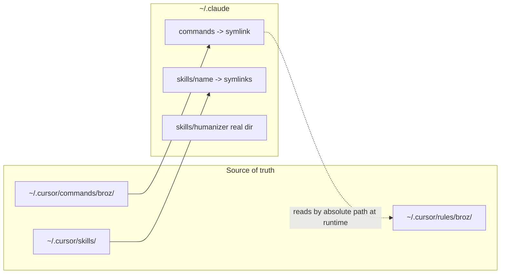

# Mirror Broz OS from .cursor into .claude via symlinks

## Why this works with no file conversion

Cursor and Claude Code use nearly identical conventions here, which is why symlinks are enough:

- **Commands**: both read plain `.md` files and namespace by subdirectory. `~/.claude/commands/broz/build.md` becomes `/broz:build`, exactly matching the trigger already written inside each file (`Activate Build Mode. (Trigger: broz:build)`).
- **Skills**: both use `<skill-name>/SKILL.md` with YAML frontmatter. All 10 Cursor skills already have the `name` and `description` keys Claude Code requires.
- **Rules**: Claude Code does not auto-load `.mdc` files, but this does not matter, because every Broz command reads its rules by explicit absolute path (for example `~/.cursor/rules/broz/mode.build.mdc`). Those reads resolve fine from Claude Code.



## Step 0: Safety commits in both directories

The two directories are in very different states, so they need different handling.

### 0a. Scoped commit in `~/.cursor`

This is a healthy repo on `main`, 5 commits deep, and all the Broz OS files we depend on (`commands/`, `rules/`, `docs/`, `AGENTS.md`) are already tracked and clean. The hazard is that Cursor rewrote `.gitignore` into a `CURSOR MANAGED BLOCK` that un-ignores `projects/**`, so a blanket `git add -A` would stage 10,467 files and 50 MB of agent transcripts and terminal dumps. Stage explicitly instead:

```bash
cd /home/broz/.cursor
git add .gitignore skills/youtube-publish skills-cursor plans/*.plan.md
git status --short   # confirm projects/ is still listed as untracked
git commit -m "chore: snapshot Broz OS state before mirroring into .claude"
```

The `plans/*.plan.md` files are tiny and `plans/**` is already an allowlisted, tracked path, so they are included to keep `git status` clean. Drop them from the `git add` if you would rather not.

### 0b. Give `~/.claude` its own repo

`~/.claude` is not a git repo. It is an untracked directory inside the home dotfiles repo at `/home/broz/.git`, which tracks only 4 files and has no `.gitignore`. Committing it there would capture 71 MB including `.credentials.json` (live Claude auth tokens), `history.jsonl`, `sessions/`, `telemetry/`, and 61 MB of `projects/`. So instead, create a self-contained repo using the same deny-by-default allowlist pattern `~/.cursor` already uses.

First write `/home/broz/.claude/.gitignore`:

```gitignore
# Deny by default
*

# Config
!.gitignore
!settings.json
!settings.local.json

# Capabilities worth versioning
!skills/
!skills/**
!scheduled-tasks/
!scheduled-tasks/**
!commands

# humanizer carries its own .git; leave it independently versioned
skills/humanizer/

# Never track: secrets and runtime state
.credentials.json
```

Then initialise and take the baseline snapshot:

```bash
cd /home/broz/.claude
git init
git add -A
git status --short   # MUST show no .credentials.json, projects/, sessions/, history.jsonl
git commit -m "chore: baseline Claude Code config before Broz OS symlinks"
```

The `git status --short` check before committing is the important step here. Do not proceed past it if any secret or bulk directory appears.

Two notes. `!commands` has no trailing `/**` on purpose, because after Step 1 it is a symlink rather than a directory, and git stores symlinks natively as mode `120000` blobs. And `git init` here changes nothing about the home repo, which will continue to show `.claude/` as untracked, exactly as it already does for `.cursor/`.

## Step 1: Link the commands directory

`~/.claude/commands/` does not exist yet, so the whole directory can be linked. This is future-proof: any new command added to `~/.cursor/commands/broz/` appears in Claude Code automatically.

```bash
ln -s /home/broz/.cursor/commands /home/broz/.claude/commands
```

This exposes all 15 commands as `/broz:build`, `/broz:menu`, `/broz:plan`, `/broz:task`, `/broz:docs`, `/broz:research`, `/broz:init`, `/broz:filebug`, `/broz:freeball`, `/broz:transcribe`, `/broz:transcriptcleanup`, `/broz:updatedocs`, `/broz:committomain`, `/broz:whatisbroze`, `/broz:youtube`.

## Step 2: Link the portable skills individually

Do NOT link the whole `skills/` directory, since `~/.claude/skills/humanizer/` is a real directory that must be preserved. Link the five skills that are useful outside Cursor:

```bash
for s in web-search github-search reddit-search youtube-search youtube-publish; do
  ln -s "/home/broz/.cursor/skills/$s" "/home/broz/.claude/skills/$s"
done
```

Skipped on purpose (Cursor-product-specific, no value inside Claude Code): `create-rule`, `create-skill`, `create-subagent`, `migrate-to-skills`, `update-cursor-settings`. Adding them later is one more `ln -s` each.

## Step 3: No global bootloader

Per the opt-in choice, no `~/.claude/CLAUDE.md` is created. Broz OS activates only when a `/broz:` command is run. Note that Claude Code 2.1.220 natively reads project-level `AGENTS.md`, so `/home/broz/code/citadel/AGENTS.md` will still fire the bootloader inside the citadel repo without any extra work.

## Step 4: Verify

```bash
ls -l /home/broz/.claude/commands /home/broz/.claude/skills
```

Then in a Claude Code session, confirm `/broz:menu` appears in the slash command list and that running it reads `plans/context.yaml` and `~/.cursor/rules/broz/mode.menu.mdc` correctly. If Claude Code turns out not to traverse the symlinked `commands` directory, the fallback is to link the inner `broz` folder instead (`mkdir ~/.claude/commands && ln -s ~/.cursor/commands/broz ~/.claude/commands/broz`), which preserves the same `/broz:` prefix.

## Step 5: Commit the symlinks

Once verified, record the links themselves so the setup is reproducible:

```bash
cd /home/broz/.claude
git add -A
git commit -m "feat: symlink Broz OS commands and portable skills from .cursor"
```

Because git stores symlinks as their target path rather than following them, this commit stays a few hundred bytes and does not duplicate any content from `~/.cursor`.

## Known caveat

`~/.cursor/rules/broz/mode.*.mdc` files may contain Cursor-specific frontmatter (`alwaysApply`, `globs`). Claude Code will read them as ordinary markdown and ignore those keys, so the prose instructions still apply, just without Cursor's automatic glob-based attachment. Since Broz commands read them explicitly, behavior should match.