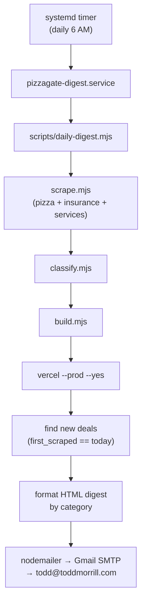

# Daily Deal Digest — Email + Scheduler

## Architecture



## New File: `scripts/daily-digest.mjs`

Standalone script (no server dependency). Runs the full pipeline via `child_process.execSync`, then:

1. Reads all `deals/*.yaml` files
2. Filters to deals where `first_scraped == today` (new) or `price_changed_date == today` (price changes)
3. Groups by `type`: `pizza`, `insurance`, `services`
4. For each deal, parses numeric values from string fields (`$750,000` → `750000`) and computes `SDE/Ask` multiple
5. Renders an HTML email with three sections
6. Sends via nodemailer using Gmail SMTP credentials

**Email sections per deal:**
- Title + BizBuySell URL
- Location
- Ask | Revenue | SDE | Multiple (SDE ÷ Ask, shown as e.g. `0.21x`)
- If `SDE` or `Ask` is not disclosed, column shows `—`

**Subject line:** `Deal Digest [Apr 15, 2026] — 3 new (2 pizza, 0 insurance, 1 service)`

## New Env Vars (add to `.env`)

```
DIGEST_EMAIL_USER=<gmail address>
DIGEST_EMAIL_PASS=<gmail app password>
DIGEST_TO=todd@toddmorrill.com
```

User needs to create a Gmail App Password at https://myaccount.google.com/apppasswords (requires 2FA enabled).

## New package.json script

```json
"digest": "node scripts/daily-digest.mjs"
```

## Systemd Timer (user-level, no sudo)

Two files under `~/.config/systemd/user/`:

**`pizzagate-digest.service`**
```ini
[Unit]
Description=Pizzagate daily deal digest

[Service]
Type=oneshot
WorkingDirectory=~/code/pizzagate
EnvironmentFile=~/code/pizzagate/.env
ExecStart=/usr/bin/node ~/code/pizzagate/scripts/daily-digest.mjs
StandardOutput=journal
StandardError=journal
```

**`pizzagate-digest.timer`**
```ini
[Unit]
Description=Run pizzagate digest daily at 6 AM

[Timer]
OnCalendar=*-*-* 06:00:00
Persistent=true

[Install]
WantedBy=timers.target
```

Activated with:
```bash
systemctl --user daemon-reload
systemctl --user enable --now pizzagate-digest.timer
```

## Key Implementation Details

- **Parse financials**: strip `$`, commas, convert to float; `"Not Disclosed"` / empty → `null`
- **Multiple**: `sde / asking_price`, shown as `0.XX x` or `—` if either is null
- **Category labels** in email: `Pizza Restaurants`, `Insurance Agencies`, `Home & Commercial Services`
- **No new deals fallback**: if 0 new deals, still send email noting "No new listings today" + any price changes
- **Nodemailer dep**: `npm install nodemailer` (add to package.json dependencies)
- **Pipeline stderr**: captured and logged to stdout for journald; non-zero exit from pipeline sends a failure email instead of digest