# Daily Digest Email Pipeline

## Architecture

```mermaid
flowchart LR
    subgraph timer [systemd user timer]
        Timer["daily-digest.timer\n(6 AM ET daily)"]
    end

    subgraph service [systemd user service]
        Service["daily-digest.service"]
    end

    subgraph script [scripts/daily-digest.mjs]
        Snapshot["Snapshot deal IDs\nbefore scrape"]
        Scrape["Run scrape.mjs x4\n(pizza, insurance, services x2)"]
        Classify["Run classify.mjs"]
        Build["Run build.mjs"]
        Deploy["vercel --prod --yes"]
        Diff["Diff: new deals,\nprice changes"]
        Render["Render HTML email\nsectioned by type"]
        Send["Send via Nodemailer\n(Gmail App Password)"]
    end

    Timer --> Service --> Snapshot --> Scrape --> Classify --> Build --> Deploy --> Diff --> Render --> Send
```



## Key Design Decisions

- **Standalone script** (`scripts/daily-digest.mjs`): Does not depend on the Express server running. Spawns scrape/classify/build/deploy as child processes exactly like the `/api/refresh-all` endpoint does, but captures structured results.
- **Nodemailer + Gmail App Password**: No new SaaS dependency. Gmail SMTP (`smtp.gmail.com:587`) with an App Password stored in `.env`. This is the simplest path since the project already uses dotenv and has Google credentials.
- **systemd user timer**: Matches the existing pattern on this machine (`bisync-deals.timer`, `onedrive-sync.timer`). Reliable, logs via `journalctl --user`, survives reboots with linger.
- **Jest for E2E tests**: New `devDependency`. Tests validate the digest data computation, HTML rendering, and email send (mocked SMTP).

## File Changes

### 1. New script: `scripts/daily-digest.mjs`

The main orchestrator. Responsibilities:

- **Pre-scrape snapshot**: Read `deals/*.yaml` listing IDs + financials into a Map
- **Run pipeline**: Spawn each step as a child process sequentially (same approach as `server.mjs` refresh-all). Parse scraper stdout for the `Done! X new, Y updated` summary line.
- **Post-scrape diff**: Re-read `deals/*.yaml`, compare to snapshot to identify:
  - New deals (listing ID not in snapshot)
  - Price changes (asking_price or sde changed)
- **Load classifications**: Read `classifications.json` to get `type` confirmation and classification fields
- **Compute digest data**: For each new/changed deal, extract: `title`, `location`, `type`, `asking_price`, `revenue`, `sde`, and compute `sde_ask_multiple` (parsed SDE / parsed asking price)
- **Section by category**: Group into `Pizza`, `Insurance`, `Home Services` (service_category = HOME_SERVICES), `Commercial Services`, `Specialty Trade`, `Professional Services`, `Other Services`
- **Render HTML**: Build an HTML email with a table per section. Columns: Title, Location, Ask, Revenue, SDE, SDE/Ask Multiple. Include pipeline summary at top (X new, Y price changes, Z total deals).
- **Send email**: Nodemailer transport using `GMAIL_USER` + `GMAIL_APP_PASSWORD` from `.env`. Recipient: `todd@toddmorrill.com`. Subject: `Deal Digest - {date}`.

Key code patterns to reuse from [viewer/server.mjs](viewer/server.mjs):

- Child process spawning (lines 824-965, the `spawn` + `fwd` pattern)
- Deal loading + classification merging (lines 60-101, the `/api/deals` handler)
- Financial string parsing: `parseInt((deal.asking_price || "").replace(/\D/g, "")) || 0`

### 2. New file: `scripts/lib/digest-helpers.mjs`

Pure functions extracted for testability:

- `snapshotDeals(dealsDir)` - reads YAML dir, returns `Map<listingId, {asking_price, sde, revenue}>`
- `diffDeals(before, after)` - returns `{newDeals: [], priceChanges: []}`
- `parseMoney(str)` - `"$454,054"` to `454054`; `"Not Disclosed"` / empty to `null`
- `computeMultiple(sde, askingPrice)` - `parseMoney(sde) / parseMoney(askingPrice)`, returns number or null
- `categorizeDeal(deal, classification)` - returns section label string
- `buildDigestData(newDeals, priceChanges, classifications)` - groups deals by section, computes financials
- `renderDigestHtml(digestData, summary)` - returns HTML string

### 3. New file: `scripts/lib/digest-email.html.mjs`

HTML template as a tagged template literal function. Clean table-based email layout (inline CSS for email client compatibility). Sections:

- Header: "Deal Pipeline Digest - {date}"
- Summary bar: "X new deals, Y price changes | Z total deals in pipeline"
- Per-section table: Title (linked to BizBuySell URL), Location, Ask, Revenue, SDE, SDE/Ask Multiple
- Footer: link to https://acquisitions.toddmorrill.com/

### 4. Modified: [package.json](package.json)

- Add `devDependencies`: `jest` (latest), `@jest/globals` (for ESM support)
- Add `dependencies`: `nodemailer`
- Add scripts:
  - `"daily-digest": "node scripts/daily-digest.mjs"`
  - `"test": "node --experimental-vm-modules node_modules/.bin/jest"`

### 5. Modified: `.env`

Add two new variables:

```
GMAIL_USER=todd@toddmorrill.com
GMAIL_APP_PASSWORD=<app password>
```

User will need to generate a Gmail App Password at https://myaccount.google.com/apppasswords.

### 6. New: `scripts/__tests__/digest-helpers.test.mjs`

Jest E2E tests using ESM (`import`). Test cases:

- **`parseMoney`**: `"$454,054"` -> `454054`, `"Not Disclosed"` -> `null`, `""` -> `null`, `"$1,200,000"` -> `1200000`
- **`computeMultiple`**: `("$300,000", "$900,000")` -> `0.33`, null inputs -> `null`
- **`categorizeDeal`**: pizza type -> "Pizza", insurance type -> "Insurance", services with HOME_SERVICES -> "Home Services", etc.
- **`diffDeals`**: Given before/after snapshots, correctly identifies new IDs and price changes
- **`buildDigestData`**: Full integration - given raw deal data + classifications, produces correct grouped structure with computed financials
- **`renderDigestHtml`**: Output contains expected section headers, deal titles, and formatted dollar amounts; is valid HTML

### 7. New: `scripts/__tests__/daily-digest.e2e.test.mjs`

End-to-end test that:

- Mocks `child_process.spawn` to simulate scraper/classify/build/deploy output
- Mocks `nodemailer.createTransport` to capture the sent email
- Runs the digest pipeline function
- Asserts: email was sent to `todd@toddmorrill.com`, subject matches pattern, HTML body contains section headers, deal data is present and correctly formatted
- Asserts: pipeline ran all 4 scrape jobs, classify, build, deploy in order

### 8. New systemd units

**`/home/broz/.config/systemd/user/daily-digest.service`**:

```ini
[Unit]
Description=Run Pizzagate daily digest (scrape + classify + build + deploy + email)

[Service]
Type=oneshot
ExecStart=/home/broz/.nvm/versions/node/v24.11.1/bin/node /home/broz/code/pizzagate/scripts/daily-digest.mjs
WorkingDirectory=/home/broz/code/pizzagate
Environment=PATH=/home/broz/.nvm/versions/node/v24.11.1/bin:/usr/local/bin:/usr/bin
TimeoutStartSec=900
```

Uses the full nvm node path (matching `which node` output). 15-minute timeout since the full pipeline with 4 scrape jobs typically takes 8-12 minutes.

**`/home/broz/.config/systemd/user/daily-digest.timer`**:

```ini
[Unit]
Description=Daily digest at 6 AM ET

[Timer]
OnCalendar=*-*-* 06:00:00 America/New_York
Persistent=true

[Install]
WantedBy=timers.target
```

Activation:

```bash
systemctl --user daemon-reload
systemctl --user enable --now daily-digest.timer
```

## Handling Edge Cases

- **No new deals / no changes**: Email still sends with "No new deals today" message so you know the pipeline ran successfully.
- **Scraper failure**: Non-zero exit from a scrape job logs a warning but continues (same behavior as refresh-all). The digest email includes a "Warnings" section if any scraper failed.
- **Headed Firefox**: The scraper uses headed Firefox. The systemd service will need `DISPLAY` or the machine needs to be logged in with a graphical session. If headless is needed, add `--headless` flag to the scraper spawn args.
- **Financial "Not Disclosed"**: Rendered as "N/D" in the email table; SDE/Ask multiple shows "-" when either value is missing.
