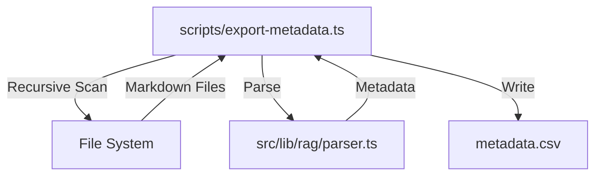

I will create a new script `scripts/export-metadata.ts` that uses `glob` to find all `.md` files in a target directory. For each file, it will use the existing `parseFrontMatterFromFile` utility to extract metadata and then write the results to a CSV file.

### Proposed Architecture

### Key Components

1.  **Scanner**: Use `glob` or recursive `fs.readdir` to find all `.md` files.
2.  **Parser**: Leverage `parseFrontMatterFromFile` from `src/lib/rag/parser.ts`.
3.  **Exporter**: Format the extracted data into CSV rows, handling special characters in summaries and tags.

### Implementation Details

-   **Path**: `scripts/export-metadata.ts`
-   **Dependencies**: `commander`, `glob`, `csv-stringify` (or simple manual CSV formatting if preferred).
-   **Columns**: `path`, `title`, `type`, `status`, `tags`, `human_summary`, `vector_summary`.