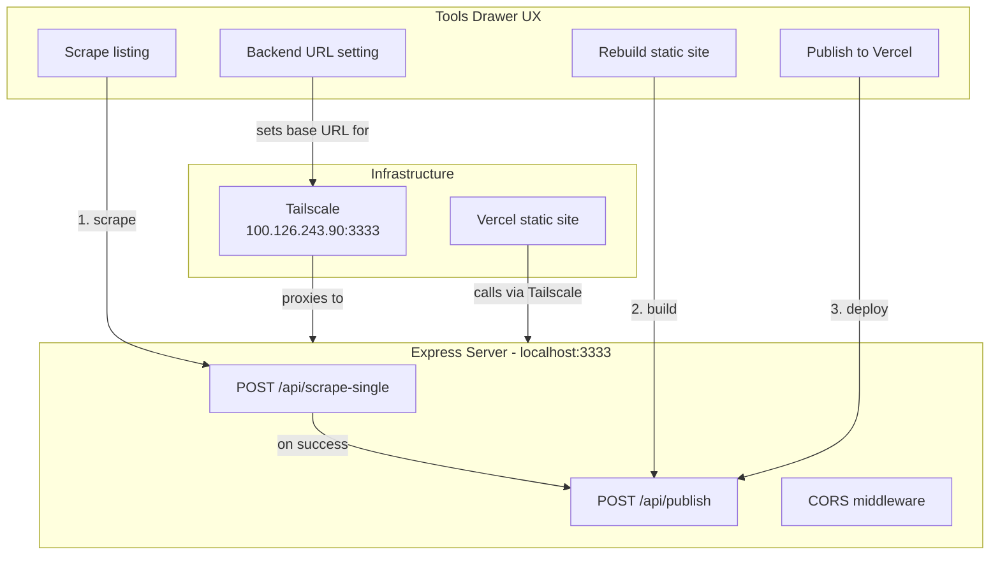

# Publish + Tailscale Tools

## Current state

After scraping a listing locally, the Vercel deploy (`slopdogmanda.vercel.app`) has no idea. The static `dist/deals.json` is a frozen snapshot from the last `node build.mjs` + `vercel --prod` run. Status/notes sync via Supabase, but deal data does not.

## What changes

## Part 1: Auto rebuild + deploy after scrape

### New server endpoint in [viewer/server.mjs](viewer/server.mjs)

`POST /api/publish` — SSE endpoint that:

1. Runs `node build.mjs` (rebuild), streams stdout/stderr as log events
2. On success, runs `vercel --prod --yes` from the `dist/` directory, streams output
3. Returns a result event with the deploy URL on success

### Updated steps UI in [viewer/index.html](viewer/index.html)

Add two more steps to the progress indicator:

- Step 7: "Rebuilding static site" (runs during `build.mjs`)
- Step 8: "Publishing to Vercel" (runs during `vercel --prod`)

After a successful scrape, the frontend automatically calls `/api/publish` and advances through steps 7-8. The full flow becomes:

1. Connecting to scraper
2. Launching browser
3. Loading listing page
4. Scraping details
5. Downloading photos
6. Saving to board
7. Rebuilding static site
8. Publishing to Vercel

## Part 2: Tailscale backend config

### CORS in [viewer/server.mjs](viewer/server.mjs)

Add permissive CORS headers so the Vercel origin (`slopdogmanda.vercel.app`) can make cross-origin requests to the local server.

### Backend URL setting in [viewer/index.html](viewer/index.html)

Add a "Backend URL" config input at the top of the Tools drawer:

- Text input, persisted to `localStorage`
- Default: empty (uses relative URLs, works on localhost)
- On the deployed site, user sets it once to `http://100.126.243.90:3333`
- All tool API calls (`/api/scrape-single`, `/api/publish`) prepend this base URL
- A small connection indicator shows whether the backend is reachable

### What uses Tailscale, what doesn't

- **Via Tailscale (local server):** scrape-single, publish (these need Node/Puppeteer/Vercel CLI)
- **Static from Vercel:** deals.json, photos, index.html (unchanged)
- **Direct to Supabase:** status, notes, pass reason (unchanged)

This means the deployed site still works fully offline (just can't scrape or publish). When the local server is reachable via Tailscale, the Tools drawer lights up.