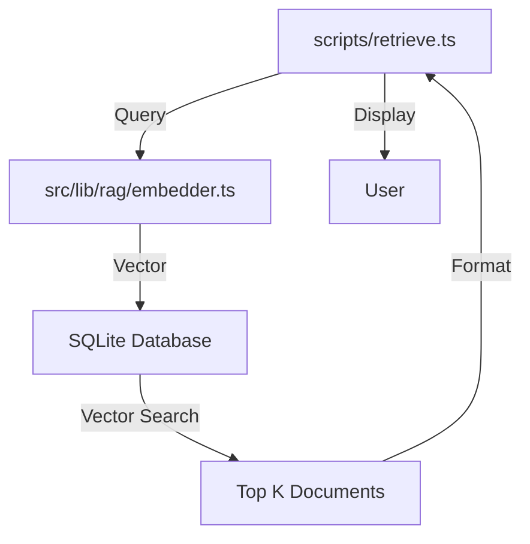

I will create a new script `scripts/retrieve.ts` that implements the retrieval side of the RAG pipeline. It will accept a query string, embed it using the same model as the archive process, and query the `documents_vec` virtual table for nearest neighbors.

### Proposed Architecture



### Key Components

1.  **CLI Interface**: Use `commander` to accept a query argument and optional flags (e.g., `--limit`).
2.  **Embedding**: Reuse `src/lib/rag/embedder.ts` to convert the query into a vector.
3.  **Vector Search**: Execute a SQL query against the `documents_vec` table using `vec_distance_cosine` (or similar) to find matches.
4.  **Result Formatting**: Join with the `documents` table to retrieve metadata (title, path, summary) and display it nicely.

### Implementation Details

-   **Path**: `scripts/retrieve.ts`
-   **Dependencies**: `commander`, `better-sqlite3`, `sqlite-vec`
-   **SQL Logic**:
    ```sql
    SELECT
      rowid,
      distance
    FROM documents_vec
    WHERE embedding MATCH ?
    ORDER BY distance
    LIMIT ?
    ```
    *(Note: `sqlite-vec` syntax might vary slightly depending on the exact version/function used, e.g., `vec_distance_cosine` vs `MATCH`)*.

### SQL Query Strategy for `sqlite-vec`
Since `sqlite-vec` is relatively new, I will use the standard KNN search pattern:
```sql
SELECT
  rowid,
  distance
FROM documents_vec
WHERE embedding MATCH ?
ORDER BY distance
LIMIT k
```
Then join with `documents` table on `rowid` to get the details.
