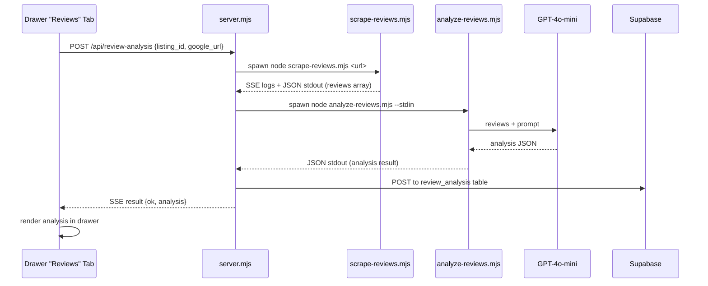

# Review Analysis Tab

## Architecture

The feature follows the exact same pattern as the existing refresh pipeline: a new Puppeteer script scrapes Google Reviews, a separate script analyzes them with GPT-4o-mini, and the server orchestrates both via SSE. Results persist to a new Supabase table.




## New Files

### 1. `scripts/scrape-reviews.mjs` -- Puppeteer Google Reviews scraper

- Accepts a Google Maps/Business URL as CLI arg
- Launches Puppeteer (Firefox, headed, same as `scrape.mjs`)
- Navigates to the reviews section, scrolls to load all reviews
- Extracts: reviewer name, star rating (1-5), date, review text
- Outputs JSON array to stdout: `[{name, stars, date, text}, ...]`
- Progress logged to stderr (for SSE forwarding)
- Google Maps review URLs look like `https://www.google.com/maps/place/...` -- the script navigates to the reviews tab, sorts by "Newest" or "Most relevant", and scrolls to paginate

### 2. `scripts/analyze-reviews.mjs` -- GPT-4o-mini review analyzer

- Reads review JSON from stdin (piped from scrape output or a file)
- Loads the prompt from `scripts/prompts/review-analysis.md` (separate file so it's easy to edit)
- Calls OpenAI `gpt-4o-mini` with `response_format: { type: "json_object" }` (same pattern as [classify.mjs](scripts/classify.mjs))
- Filters to only 1-3 star reviews before sending to the model
- Outputs JSON result to stdout

### 3. `scripts/prompts/review-analysis.md` -- The LLM prompt (separate, editable file)

The prompt will instruct the model to:

- Receive all 1-3 star reviews as input
- Identify recurring complaint patterns/themes (e.g., "slow service", "cold food", "rude staff")
- For each pattern: theme name, frequency count, severity assessment, representative quotes
- Produce an overall negative sentiment summary
- Flag any deal-breaker patterns (health/safety, management dysfunction)
- Output structured JSON

Proposed prompt output schema:

```json
{
  "total_reviews_analyzed": 45,
  "negative_reviews_count": 12,
  "star_distribution": {"1": 3, "2": 4, "3": 5},
  "patterns": [
    {
      "theme": "Slow Service / Long Wait Times",
      "count": 7,
      "severity": "high",
      "quotes": ["Waited 45 min for a pizza...", "..."],
      "summary": "Multiple reviewers report..."
    }
  ],
  "deal_breakers": [
    {
      "theme": "Health Code Concerns",
      "detail": "Two reviewers mention seeing...",
      "quotes": ["..."]
    }
  ],
  "overall_summary": "This location struggles primarily with...",
  "positive_notes": "Despite complaints, many reviewers praise the food quality itself."
}
```

### 4. Supabase: `review_analysis` table

New table with columns:

- `listing_id` (text, primary key)
- `google_url` (text)
- `total_reviews` (integer)
- `negative_count` (integer)
- `analysis` (jsonb -- the full analysis JSON from the LLM)
- `raw_reviews` (jsonb -- the scraped reviews array for re-analysis)
- `analyzed_at` (timestamptz)
- `updated_at` (timestamptz, default now())

Created via `psql $DATABASE_URL` using the pooler connection.

### 5. Server: `POST /api/review-analysis` in [server.mjs](viewer/server.mjs)

- Accepts `{ listing_id, google_url }`
- SSE response (same pattern as refresh pipeline)
- Phase 1 "scrape": spawns `scrape-reviews.mjs <url>`, captures stdout as review JSON
- Phase 2 "analyze": spawns `analyze-reviews.mjs`, pipes the review JSON via stdin
- Phase 3 "save": upserts result to Supabase `review_analysis` table via REST API
- Sends final `{ type: "result", ok: true, analysis: {...} }`

### 6. UI: "Reviews" drawer tab in [viewer/index.html](viewer/index.html)

**Tab button** -- add after the Finance tab:

```html
<button class="drawer-tab" data-tab="reviews" onclick="switchDrawerTab('reviews')">Reviews</button>
```

**Tab content** (rendered by new `renderReviewsTab()` function):

- If analysis exists in Supabase: show the rendered analysis (patterns, deal breakers, summary)
- If no analysis yet: show a form with:
  - Google Reviews URL input field (pre-filled from `google_url` in deal YAML if it exists)
  - "Analyze Reviews" button
  - SSE log output area (same pattern as refresh pipeline log in Tools drawer)
- After analysis completes: re-render with results

**Data flow on page load:**

- `loadSupaOverrides()` already fetches from Supabase on init -- extend it (or add a parallel fetch) to also load `review_analysis` rows
- Merge into each deal as `deal.review_analysis`
- The Reviews tab checks `_currentDeal.review_analysis` to decide form vs results view

## Key Decisions

- **Puppeteer + Firefox** for scraping, matching existing stack exactly (no new dependencies for scraping)
- **Prompt in a separate `.md` file** so you can tweak it without touching code
- **Supabase for persistence** -- works on both local dev and deployed Vercel site
- **No build/deploy step** in this pipeline (unlike refresh) -- just scrape, analyze, save
- **stdin piping** between scraper and analyzer keeps them decoupled (can re-analyze existing reviews without re-scraping)

